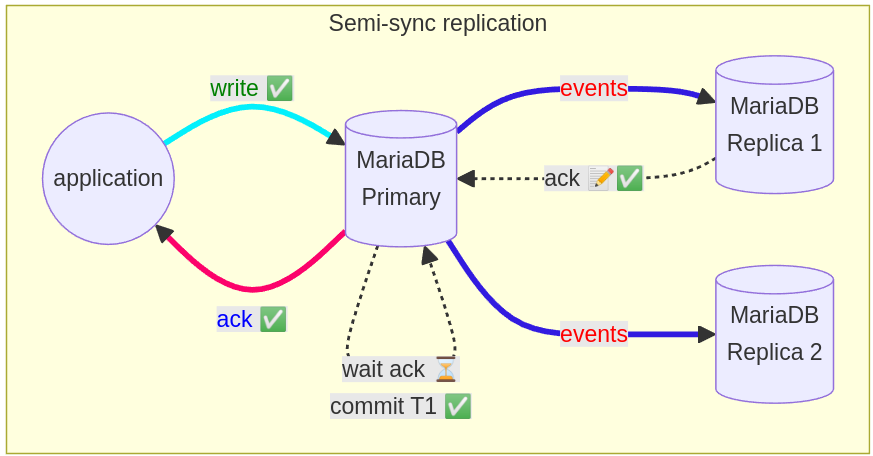

https://mariadb.org/mariadb-semi-sync-replication-using-containers/



Download

```
wget https://raw.githubusercontent.com/shivanand-patil/TheDataSeminar/main/Week-02/exercises/mariadb-replicatio/.env

wget https://github.com/shivanand-patil/TheDataSeminar/raw/main/Week-02/exercises/mariadb-replicatio/docker-compose.yaml
```

Create a master and two replicas

```
docker compose up -d

docker compose ps

```

Check that semi-sync is enabled using the mariadb client

```
docker exec -it mariadb-primary mariadb -uroot -psecret -e "select @@rpl_semi_sync_master_enabled;"
```

Check the rpl_semi_sync_master_timeout variable (default 10 [s]). When this time elapses and the primary doesn’t get any acknowledgment from the replica, it switches back to asynchronous replication.

```
docker exec -it mariadb-primary mariadb -uroot -psecret -e "select @@rpl_semi_sync_master_timeout;"
```

Check primary status (check position in the binlog as well as the name of the binlog).

```
docker exec mariadb-primary mariadb -uroot -psecret -e "show master status\G;"
```

Check databases for replication

```
docker exec -it mariadb-primary mariadb -uroot -psecret -e "show databases like '%test%'";
```

Check binary logs

```
docker exec --workdir /var/lib/mysql mariadb-primary bash -c "ls maria*"
```

The same can be seen from the mariadb client

```
docker exec mariadb-primary mariadb -uroot -psecret -e "show binary logs\G;"
```

example of fresh start

```
docker exec mariadb-primary mariadb-binlog /var/lib/mysql/mariadb-bin.000002
```

Check replica’s status

```
docker exec -it mariadb-replica-1 mariadb -uroot -psecret -e "select @@rpl_semi_sync_slave_enabled;"

docker exec -it mariadb-replica-2 mariadb -uroot -psecret -e "select @@rpl_semi_sync_slave_enabled;"
```

Check replicated database

```
docker exec -it mariadb-replica-1 mariadb -uroot -psecret -e "show databases like '%test%'";
docker exec -it mariadb-replica-2 mariadb -uroot -psecret -e "show databases like '%test%'";
```

Transaction:

```
CREATE TABLE `t` (
  `t` char(15) NOT NULL
);

INSERT INTO `t` (`t`)
VALUES ('Nilesh');

INSERT INTO `t` (`t`)
VALUES ('Ayaan');

INSERT INTO `t` (`t`)
VALUES ('Vikas');

INSERT INTO `t` (`t`)
VALUES ('Sahil');

INSERT INTO `t` (`t`)
VALUES ('Shivanand');
```

validate the binlog using the mariadb-binlog client (binlog below),

```
docker exec -it mariadb-primary mariadb -uroot -psecret -e "show master status;"
docker exec mariadb-primary mariadb-binlog /var/lib/mysql/mariadb-bin.000002

```

INSERT VALUES using adminer

and

results of replication, validated on the replica (replica below).

```
docker exec -it mariadb-replica-1 mariadb -uroot -psecret -e "show replica status \G;"
docker exec -it mariadb-replica-2 mariadb -uroot -psecret -e "show replica status \G;"

```

Check the content of the table t in test database

```
docker exec -it mariadb-replica-1 mariadb -uroot -psecret -e "use testdb; show tables; show create table t;"
docker exec -it mariadb-replica-2 mariadb -uroot -psecret -e "use testdb; show tables; show create table t;"

docker exec -it mariadb-primary mariadb -uroot -psecret -e "show master status;"

docker exec -it mariadb-replica-1 mariadb -uroot -psecret -e "select * from testdb.t"
docker exec -it mariadb-replica-2 mariadb -uroot -psecret -e "select * from testdb.t"
```

Show replica hosts

```
docker exec -it mariadb-primary mariadb -uroot -psecret -e "SHOW REPLICA HOSTS;"
```

Destroy everything

```
docker compose down --remove-orphans
```
